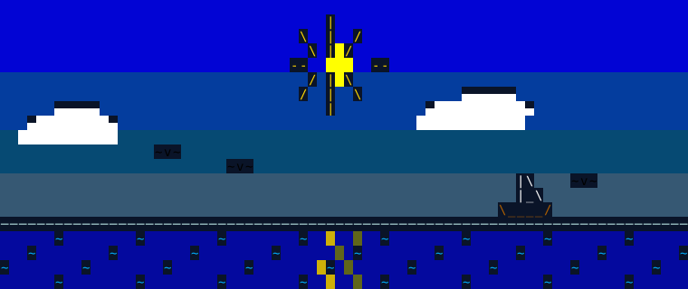

<p align="center">
  
</p>

```
                            _
  __ _ _ __ ___   _____   _(_) ___ _ __
 / _` | '__/ _ \ / _ \ \ / / |/ _ \ '__|
| (_| | | | (_) | (_) \ V /| |  __/ |
 \__, |_|  \___/ \___/ \_/ |_|\___|_|
 |___/
```

> **The runtime surgery kit for Minecraft modpacks.**
> Bend mods back into shape with Groovy scripts — where KubeJS ends, Groovier begins.


[English Guide](docs/groovier-guide-en.md) | [中文指南](docs/groovier-guide.md)

---

## What is Groovier?

Groovier is a powerful **compatibility repair tool** for mod developers and modpack maintainers.
It is *not* a content framework — use KubeJS for recipes and items. Groovier handles what KubeJS cannot reach: **directly modifying the Java runtime of Minecraft and other mods**.

Four tiers of intervention, lowest first — *always use the gentlest tier that works*:

| Tier | Tool | Use when |
|---|---|---|
| 1 | Event listeners (plain scripts) | Behavior can be expressed with native NeoForge events |
| 2 | **Pins** — method pins | Intercept any method: override its return value, or eavesdrop after it runs |
| 3 | **Surgery** — mixin removal / bytecode patches | The problem lives in *someone else's mixin* |
| 4 | **Override** — whole-class replacement | Structural needs: fields / constructors / class hierarchy (last resort) |

Plus: hot-reloadable Groovy scripts, persistent global variables, dynamic script on/off switching, a built-in decompiler workflow, and a KubeJS event bridge.

## Quick Start

Drop a script into `groovy_scripts/hello.groovy`, enter a world (or run `/groovier reload`), and check `logs/groovier.log`:

```groovy
Log.info("Hello! Level class = {}", Level.class.simpleName)

int n = 0
EventManager.listen { ServerTickEvent.Post event ->
    if (++n % 200 == 0) Log.info("tick #{}", event.server.tickCount)
}
```

In-game commands (OP required): `/groovier` or `/gvr` — `reload`, `scripts`, `pins`, `surgery`, `override`, `refer`, `classtree`, `mixin`, `help`...

Full documentation with tutorials (events, globals, pins, surgery with an ASM primer, whole-class override, reconnaissance workflow, sandbox rules):

- **[English Guide](docs/groovier-guide-en.md)**
- **[中文指南](docs/groovier-guide.md)** (also built into the jar — `/gvr help` exports it to `local/`)

## SERENE Team

<p align="center">
  
</p>
<p align="center"><i>clear skies over calm waters — 晴空之飨</i></p>

**SERENE** is an open-source, remote-collaboration team, born from the development of the Minecraft modpack **晴空之飨** (*Bluesky Fantaste*).

The name takes the word's archaic sense — **"clear skies"** — and carries a touch of magic.
We believe in game atmospheres that feel **transcendent, joyful, relaxed, and immersive**.

## Building from Source

```bash
./gradlew build
# output: build/libs/groovier-<version>.jar
```

Requires Java 21. Note: the optional KubeJS compile-time jars (place under `libs/`, see `build.gradle`) are not committed to this repository.

## Acknowledgements

- Built on [NeoForge](https://neoforged.net/), [Apache Groovy](https://groovy-lang.org/), [Vineflower](https://vineflower.org/), and [KubeJS](https://kubejs.com/) (optional integration).

### A Note on AI-Generated Code

> Part of the code in this project was generated with AI assistance.
> **Thank you for downloading and using it.** We listen carefully to feedback and suggestions, and we are committed to continually improving and regulating our practices. If you spot a problem, please open an issue — it truly helps.

## License

[MIT](LICENSE) — free to use, modify, and redistribute.

<p align="center"><i>— SERENE · clear skies, immersive worlds —</i></p>
